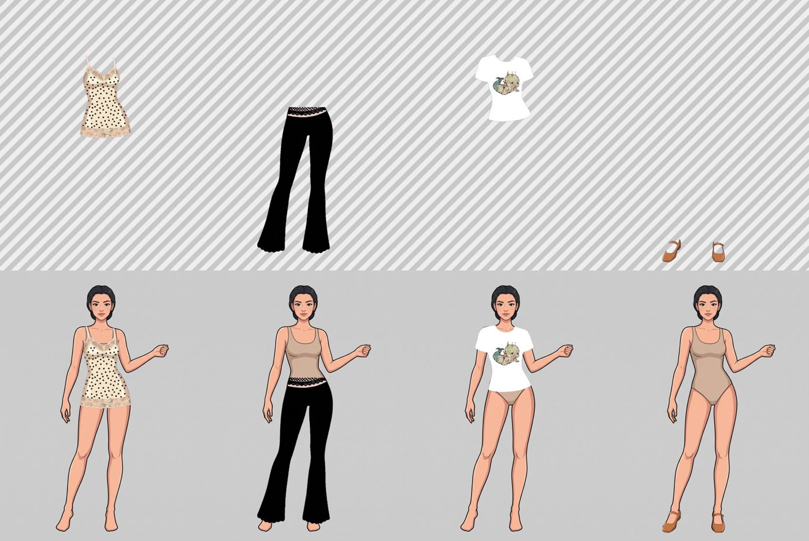

# FlashCloset

**Your real closet, turned into a dress-up game.** Take a photo of a piece of clothing you own, and FlashCloset turns it into a layer that fits your personal avatar. Then mix and match outfits and save your favorite looks.



## What it does

- **Photo → wearable layer.** Upload a photo of real clothing and a background job turns it into a transparent layer aligned to the avatar's body.
- **Personal avatar.** Each user gets an illustrated avatar built from their photo. It is checked against skin and hair tones measured from that photo, and regenerated automatically if it comes out wrong.
- **Dressing room.** Layer garments by slot (tops, bottoms, full-body, outerwear, shoes, accessories), adjust how each one sits, and save outfits.
- **Shared catalog.** Users can share garments and copy other people's shared items into their own closet.
- **Installable PWA** with sound feedback, built mobile-first.

## How the image pipeline works

```
photo + avatar ──► dress (generation 1) ──► matte (generation 2) ──► chroma key ──► layer
```

Generative image models can't output an alpha channel. If you ask for transparency they draw a checkerboard. So the pipeline splits the job:

1. **Dress:** the model draws the garment *on the avatar*, so it lands at the right scale and drapes to the body.
2. **Matte:** a second pass paints the garment area in a flat key color (magenta).
3. **Chroma key + cleanup:** the cut-out happens in code, deterministically (NumPy/SciPy). Only the largest blob inside the garment's body region is kept, which removes letterbox bars and background leaking in from the source photo.

The image backend is pluggable behind a single `Dresser` contract:

| Backend | Runs on | Trade-off |
|---|---|---|
| `gemini` | Google Gemini image model (cloud) | Fast; costs per image |
| `comfy` | FLUX.1 Kontext via local ComfyUI | Free; takes minutes per pass and ties up the local GPU |


## Tech stack

- **Backend:** Python, FastAPI, SQLAlchemy 2 (async) + aiosqlite (Postgres-ready via `DATABASE_URL`), Pydantic Settings, JWT auth with bcrypt, background jobs for garment processing
- **Image processing:** Google GenAI SDK, ComfyUI + FLUX.1 Kontext, Pillow, NumPy, SciPy
- **Frontend:** React 19, TypeScript, Vite, PWA (vite-plugin-pwa), Oxlint
- **Deployment:** the API serves the built frontend, so everything runs on one origin (one URL to expose, no CORS to configure). Registration can be closed or put behind an invite code for tunneled demos.

## Project structure

```
backend/
  app/
    api/routes/     auth, avatars, clothing items, outfits
    services/       pipeline, dressers (Gemini / ComfyUI), chroma key, garment layers, avatar factory
    jobs.py         background processing: pending → processing → ready / failed
  scripts/          seed and maintenance scripts
frontend/src/       React app (dressing room, avatar stage, sheets, login)
experiments/        smoke tests and strategy comparisons for the pipeline
prototype/          early HTML prototypes of the dressing room
```

## Running locally

**Requirements:** Python 3.12+, Node 20+, and a Gemini API key (or a local ComfyUI with FLUX.1 Kontext).

```bash
# 1. Configuration
cp .env.example gemini_api_key.env   # then set GEMINI_API_KEY

# 2. Backend (http://127.0.0.1:8000)
cd backend
python -m venv ../.venv && ../.venv/Scripts/activate   # macOS/Linux: source ../.venv/bin/activate
pip install -r requirements.txt
uvicorn app.main:app --reload --port 8000

# 3. Frontend (http://127.0.0.1:5173)
cd ../frontend
npm install
npm run dev
```

To serve everything from the API on a single URL, run `npm run build` in `frontend/`. FastAPI picks up `frontend/dist` automatically.

## Status

This is a personal project in active development. The next steps are Alembic migrations (the schema is created on startup for now), automated tests for the pipeline, and a hosted demo.

---

Built by [Martin Mojica Torres](https://github.com/martinmt-mx), with AI-assisted development (Claude Code).
